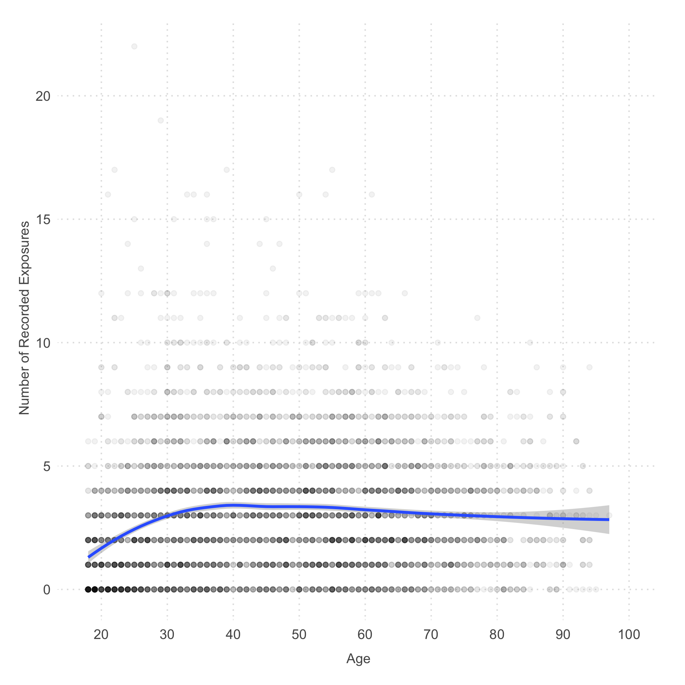
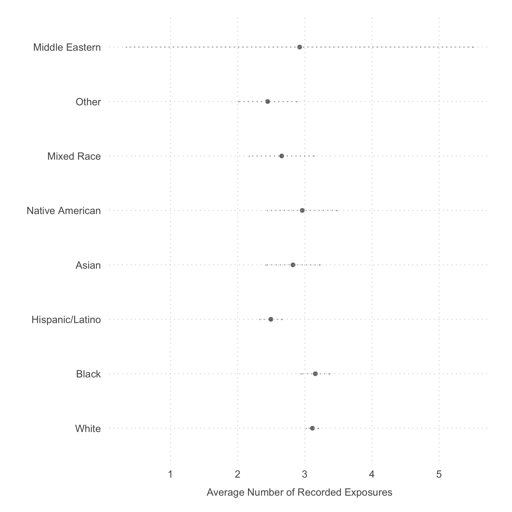
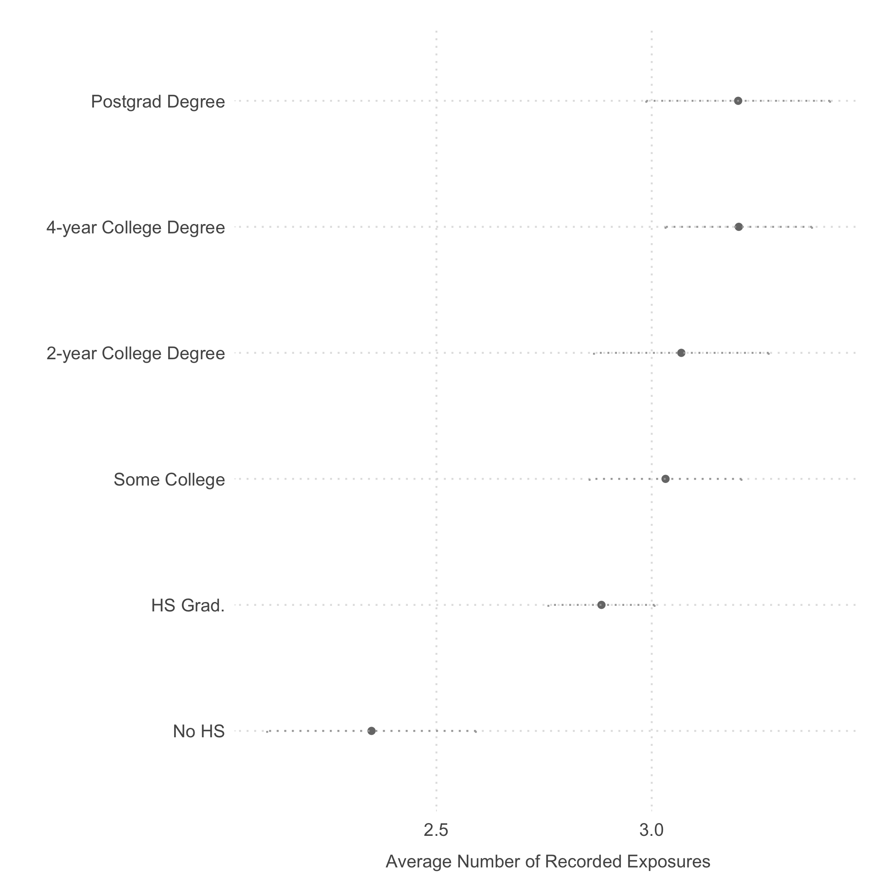
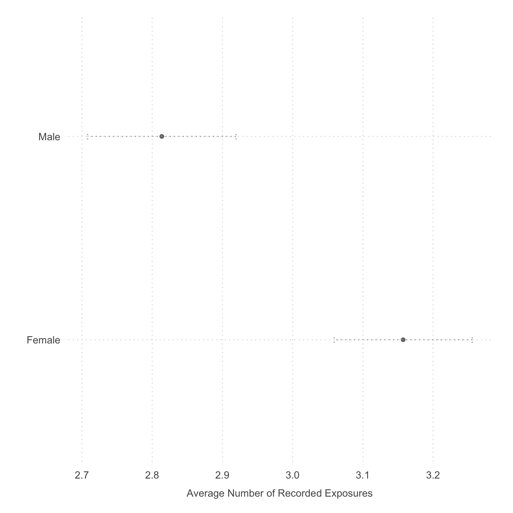

```{r setup, include=FALSE}
source("scripts/run_all.R")
```

# Pwned: The Risk of Exposure From Data Breaches

This research repository combines an archived YouGov sample with July 2018 Have I Been Pwned (HIBP) records. One registered email was queried for each of `r format(nrow(people), big.mark = ",")` adults. We study recorded exposure and its associations with age, education, sex, and race/ethnicity.

`r sprintf("%.2f", 100 * totals$share_exposed[totals$outcome == "all_exposures"])`% of sampled adults have at least one recorded exposure, with a mean of `r sprintf("%.4f", totals$mean[totals$outcome == "all_exposures"])` person–breach records. Restricting to verified, nonspam records gives `r sprintf("%.2f", 100 * totals$share_exposed[totals$outcome == "nonspam_exposures"])`% and a mean of `r sprintf("%.4f", totals$mean[totals$outcome == "nonspam_exposures"])`. Both outcomes retain every respondent, including zeros.

These are counts for one email per sampled person. HIBP coverage is incomplete, and the demographic comparisons are associations. The study does not measure online-service use or identify a causal mechanism. The [manuscript](ms/pwned.pdf) and [supplement](ms/pwned_si.pdf) explain the design and limits.

## Reproduce this revision

With R 4.6 installed, run from the repository root:

```sh
make restore
make check
make paper
```

`renv.lock` pins the R dependencies. Linux source installation needs a compiler toolchain and development headers for ICU, libxml2, and libuv, plus curl. `make paper` additionally needs TeX Live with `latexmk`, `acmart`, and the packages named in the two manuscript preambles.

- `make analysis` prepares respondent counts and writes CSV results to `results/`.
- `make exhibits` regenerates the tables, inline manuscript numbers, figures, and this README.
- `make paper` regenerates the exhibits and compiles both PDFs.
- `make check` runs the analysis, data/inference regression checks, and R lint.

The analysis uses dplyr/tidyr for preparation, `lm()` and broom for the historical OLS specifications, sandwich/lmtest for HC3 sensitivity estimates, `t.test()` for Welch sex contrasts, ggplot2 for the original figure designs, and `knitr::kable()` for tables. Run everything in R; no Python, Stata, API calls, or new data collection are required.

## What changed

The historical scripts and manuscript are preserved at commit `2a85ffe9892958b0718d3987f4b13bed1b0c8f22`. The independent audit reproduced all seven historical table bodies before changes.

- The nonspam filter previously dropped 553 people with only spam records, reducing the denominator to 4,447. Counting qualifying records before joining onto all profiles restores their zeros. The historical mean 2.0980 becomes 1.8660 from this correction alone.
- There are 28 identical duplicate records, including 26 nonspam records. Removing them yields the final means above. The 82.84% broad exposure share is unchanged.
- Race codes 6/7/8 are Mixed Race/Other/Middle Eastern, following the shipped codebook. Eighteen-year-olds belong in the youngest adult category. Demographic shares count respondents, and CPS sex shares match by category name.
- The manuscript previously counted 858 unmatched-profile rows as breach records when describing verification. All actual observed records are marked verified. The distinction in this sample is spam inclusion, not verified versus unverified exposure.
- Tables, numerical prose, and figures use the revised results. The broad education and age patterns remain; the nonspam sex gap is small and uncertain. Count ratios are described as count ratios, and online-service use remains a proposed explanation.

OLS inference is retained for comparability. `results/coefficients.csv` also reports HC3 estimates; `results/sex_contrasts.csv` gives Welch intervals for both outcomes. The paper's group plots retain mean ± 1.96 standard errors and the age plot retains loess. These intervals do not account for panel selection or incomplete HIBP coverage. CPS race/ethnicity coding remains noncommensurate, as the historical supplement already explained; no new harmonization or weights are invented.

## Data and analysis

[prepare_data.R](scripts/prepare_data.R) validates identifiers and flags, removes only identical source records, rejects conflicting repeated person–breach keys, and joins counts onto all profiles. [analyze.R](scripts/analyze.R) produces summaries, models, and the named CPS comparison. [exhibits.R](scripts/exhibits.R) supplies the paper and figures.

- [YouGov profiles](data/YGOV1058_profile.csv) and [codebook](data/Profile_codebook_ygov1058.pdf)
- [Individual HIBP records](data/YGOV1058_pwned.csv), [archived API documentation](data/hibp_v2_api.pdf), and [codebook](data/hibp_codebook.xlsx)
- [Archived breach catalogue](data/breaches.json)
- [CPS summary](data/cps_2018.csv) and [source workbook](data/cps_2018.xlsx)
- [Tables](tabs/), [figures](figs/), and [manuscript sources](ms/)

The supplied data remain unchanged. Original request logs and panel inclusion probabilities are unavailable. No new collection or account lookups are attempted.

## Figures






## Research snapshots

A dated revision freezes a reviewed commit, source data, R lockfile, generated exhibits, and compiled papers. Run the local checks and paper build before freezing a revision. Subsequent substantive work should receive another revision. This is a research repository; no new continuous validation workflow or permanent audit framework is introduced. Edit `README.Rmd`; `make exhibits` regenerates `README.md` with its numerical values.

## Authors

Ken Cor and Gaurav Sood

## Adjacent repositories

- [reg_breach](https://github.com/themains/reg_breach): HIBP evidence from voter-registration emails.
- [pwned_pols](https://github.com/themains/pwned_pols): data exposure among politicians.
- [private_blacklight](https://github.com/themains/private_blacklight): privacy online and the digital divide.
- [private_gov](https://github.com/themains/private_gov): tracking on government websites.
- [know_your_ip](https://github.com/themains/know_your_ip): IP-address information.
