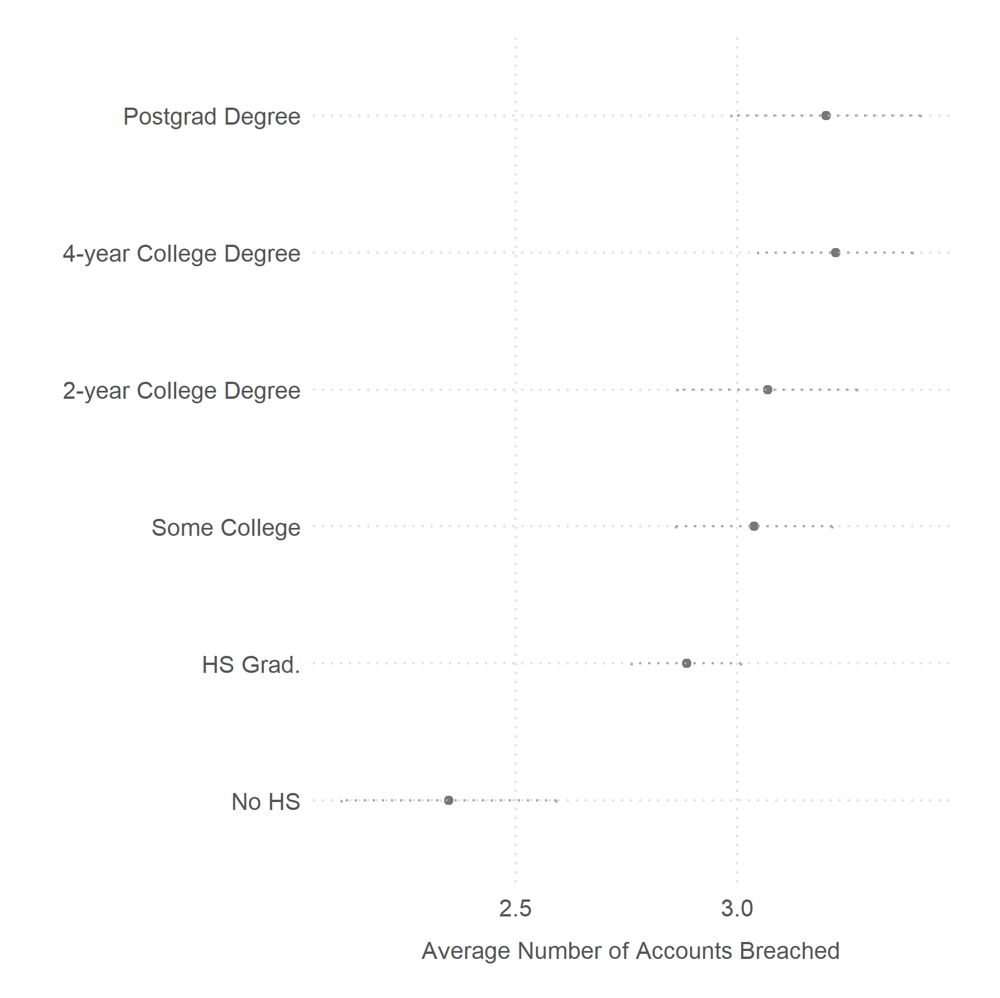
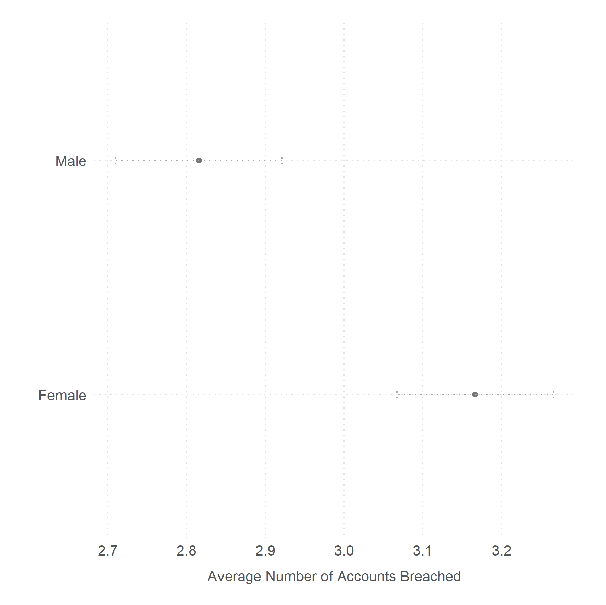

### Pwned: How Often Are Americans' Online Accounts Breached?

We merge data from a large representative sample from YouGov (n = 5,000) with data from [Have I Been Pwned (HIBP)](https://haveibeenpwned.com) to estimate how often people's information is exposed. And how that varies by race, education, income, and age.

We find that at least 82.8\% of Americans have had their accounts breached at least once. And that on average Americans' accounts have been breached at least thrice. Better educated, the middle-aged, women, and Whites and Blacks are more likely to have had their accounts breached than the complementary groups.

### Data and Analysis

* [Data](data/)
    - [YG Profile Data (CSV)](data/YGOV1058_profile.csv)
        - [YG Profile codebook (pdf)](data/Profile_codebook_ygov1058.pdf)
    - [HIBP Data on the people (CSV)](data/YGOV1058_pwned.csv)
        -  [HIBP v2 API (pdf)](data/hipb_v2_api.pdf)
        -  [HIBP codebook (xlsx)](data/hipb_codebook.xlsx)
    - [HIBP Data on Breaches (JSON)](data/breaches.json)

* [Analysis](scripts/)
    - [Jupyter notebook](scripts/pwned.ipynb)
    - [Replication R script](scripts/pwned_replication.R)

* [Figs](figs/)

* [Tables](tabs/)

* [ms: pdf, bib, and tex](ms/)

### Authors

Ken Cor and Gaurav Sood
