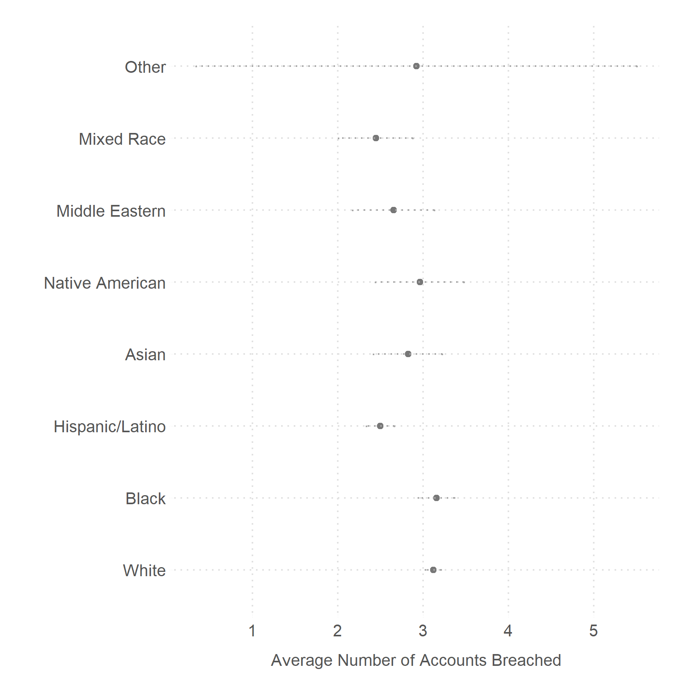

### Pwned: How Often Are Americans' Online Accounts Breached?

We merge data from a large representative sample from YouGov (n = 5,000) with data from [Have I Been Pwned (HIBP)](https://haveibeenpwned.com) to estimate how often people's information is exposed. And how that varies by race, education, income, and age.

We find that at least 82.8\% of Americans have had their accounts breached at least once. And that on average Americans' accounts have been breached at least thrice. Better educated, the middle-aged, women, and Whites and Blacks are more likely to have had their accounts breached than the complementary groups.

#### Relationship Between Age and Number of Breaches

#### Relationship Between Race and Number of Breaches

#### Relationship Between Education and Number of Breaches

#### Relationship Between Sex and Number of Breaches

-----------

### Data and Analysis

* [Data](data/)
    - [YG Profile Data (CSV)](data/YGOV1058_profile.csv)
        - [YG Profile codebook (pdf)](data/Profile_codebook_ygov1058.pdf)
    - [HIBP Data on the people (CSV)](data/YGOV1058_pwned.csv)
        -  [HIBP v2 API (pdf)](data/hibp_v2_api.pdf)
        -  [HIBP codebook (xlsx)](data/hibp_codebook.xlsx)
    - [HIBP Data on Breaches (JSON)](data/breaches.json)
    - [Current Population Survey Data (xlsx)](data/cps_2018.xlsx) and [CSV](data/cps_2018.csv)

* [Analysis](scripts/)
    - [Jupyter notebook](scripts/pwned.ipynb)
    - [R script for fancy tables, plots, and replication](scripts/pwned_replication_plus_analyses.R)
    - [R Script for comparing YG to CPS](scripts/yg_cps.R)

* [Figs](figs/)

* [Tables](tabs/)

* [ms: pdf, bib, and tex](ms/)

### Authors

Ken Cor and Gaurav Sood

## 🔗 Adjacent Repositories

- [themains/reg_breach](https://github.com/themains/reg_breach) — Have I Been Pwned? Yes. Evidence from HIBP and Emails From Voter Registration Files.
- [themains/pwned_pols](https://github.com/themains/pwned_pols) — A third of the politicians have had their data breached at least once. More alarmingly, over one in five have had their sensitive data, such as bank account numbers, biometric data, browsing history, chat logs, credit card CVV, etc., breached.
- [themains/private_blacklight](https://github.com/themains/private_blacklight) — Privacy Online and Digital Divide on Online Privacy
- [themains/private_gov](https://github.com/themains/private_gov) — How common are third-party cookies, trackers, key loggers, etc. on government websites?
- [themains/know_your_ip](https://github.com/themains/know_your_ip) — Know Your IP: Get location, blacklist status, shodan and censys results, and more.
